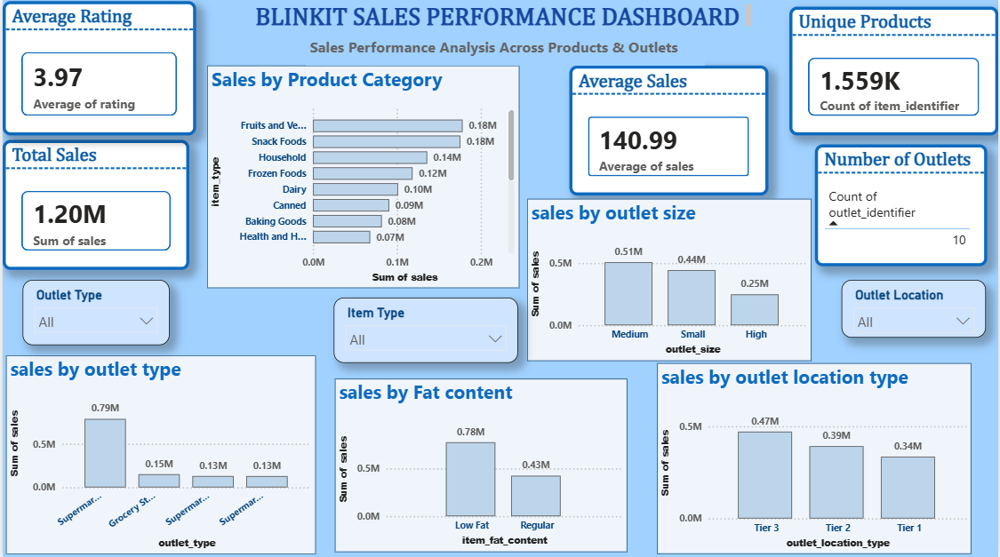

# 🛒 Blinkit Sales Analysis

### End-to-End Data Analytics Project | Python • MySQL • SQL • Power BI

---

## 📌 Project Overview

This is an end-to-end data analytics project based on Blinkit sales data.

The project follows the complete analytics lifecycle:

**Raw Data → Python → MySQL → SQL → Power BI → Business Insights**

The objective is to understand sales performance across products, outlet types, outlet sizes, location tiers, and product characteristics.

This project demonstrates practical experience in:

- Data cleaning
- Exploratory data analysis
- SQL querying
- MySQL
- Data visualization
- KPI development
- Power BI dashboard development
- Business analysis
- Data-driven recommendations
- GitHub project documentation

---

## 🎯 Business Problem

Retail businesses generate large amounts of transactional data, but raw data does not immediately explain what is driving sales performance.

This project investigates:

- Which product categories generate the highest sales?
- Which outlet types contribute the most revenue?
- Which location tier performs best?
- How does outlet size relate to sales?
- How do Low Fat and Regular products compare?
- Is product rating related to sales?
- Is item visibility related to sales?
- Which outlet segments deserve further investigation?

---

## 🎯 Project Objectives

The project was developed to:

1. Clean and prepare the raw sales dataset.
2. Perform exploratory data analysis using Python.
3. Analyze sales performance using MySQL and SQL.
4. Apply advanced SQL techniques.
5. Build an interactive Power BI dashboard.
6. Create meaningful KPIs.
7. Identify important business patterns.
8. Develop data-driven recommendations.
9. Present the complete project as a professional analytics portfolio.

---

# 📊 Dataset

The dataset contains **8,523 sales records** covering product and outlet information.

### Dataset Summary

| Metric | Value |
|---|---:|
| Total Records | 8,523 |
| Total Sales | 1,201,681.49 |
| Average Sales | 140.99 |
| Unique Products | 1,559 |
| Number of Outlets | 10 |
| Average Rating | 3.97 |

### Main Dataset Variables

| Category | Variables |
|---|---|
| Product | Item Identifier, Item Type |
| Product Attributes | Fat Content, Visibility, Weight |
| Sales | Sales |
| Outlet | Outlet Identifier, Outlet Type |
| Location | Outlet Location Tier |
| Outlet Attributes | Outlet Size, Establishment Year |
| Feedback | Rating |

---

# 🛠️ Tools & Technologies

| Technology | Purpose |
|---|---|
| 🐍 Python | Data cleaning and exploratory analysis |
| 🐼 Pandas | Data manipulation |
| 🔢 NumPy | Numerical analysis |
| 📊 Matplotlib | Data visualization |
| 📈 Seaborn | Statistical visualization |
| 🐬 MySQL | Database storage and querying |
| 💻 SQL | Business analysis |
| 📊 Power BI | Interactive dashboard |
| 🐙 GitHub | Documentation and portfolio |

---

# 🔄 Complete Project Workflow

~~~text
RAW BLINKIT DATA
       │
       ▼
┌──────────────────────┐
│ Python               │
│ Data Cleaning        │
│ Missing Values       │
│ Data Preparation     │
└──────────────────────┘
       │
       ▼
┌──────────────────────┐
│ Exploratory Analysis │
│ Statistics           │
│ Correlations         │
│ Visualizations       │
└──────────────────────┘
       │
       ▼
┌──────────────────────┐
│ MySQL Database       │
│ Data Storage         │
└──────────────────────┘
       │
       ▼
┌──────────────────────┐
│ SQL Analysis         │
│ Aggregations         │
│ CTEs                 │
│ CASE WHEN            │
│ Window Functions     │
│ Ranking              │
└──────────────────────┘
       │
       ▼
┌──────────────────────┐
│ Power BI Dashboard   │
│ KPIs                 │
│ Charts               │
│ Interactive Slicers  │
└──────────────────────┘
       │
       ▼
┌──────────────────────┐
│ Business Insights    │
│ Recommendations      │
└──────────────────────┘
~~~

---

# 🐍 Python — Data Cleaning & Exploratory Data Analysis

Python was used as the first stage of the project to prepare and understand the dataset.

### Data Cleaning

The following activities were performed:

- Loaded and inspected the raw dataset
- Checked data types
- Identified missing values
- Standardized categorical values
- Handled missing item weights
- Handled missing outlet-size values
- Prepared the dataset for analysis

### Exploratory Data Analysis

The analysis included:

- Descriptive statistics
- Sales distribution analysis
- Product category analysis
- Outlet type analysis
- Outlet size analysis
- Location tier analysis
- Fat content analysis
- Correlation analysis
- Business-oriented visualizations

### Python Analysis Questions

- Which products generate the highest sales?
- Which outlet types perform best?
- Which locations contribute the most sales?
- Is rating associated with sales?
- Is item visibility associated with sales?

### 📁 Python Project File

[**blinkit_analysis.ipynb**](./blinkit_analysis.ipynb)

The notebook contains the Python-based data cleaning and exploratory analysis.

---

# 🗄️ MySQL & SQL Analysis

The cleaned dataset was analyzed using MySQL to perform structured business analysis.

### SQL Techniques Used

- `SELECT`
- `WHERE`
- `GROUP BY`
- `ORDER BY`
- Aggregate functions
- `CASE WHEN`
- Common Table Expressions (CTEs)
- `RANK()`
- Window functions
- Partitioning
- Percentage contribution calculations

### SQL Analysis Performed

- Overall sales KPIs
- Sales by product category
- Sales by outlet type
- Sales by outlet size
- Sales by location tier
- Sales by fat content
- Outlet performance ranking
- Sales contribution analysis
- Product performance analysis
- Rating vs sales analysis
- Visibility vs sales analysis

### Example SQL Query

~~~sql
SELECT
    item_type,
    SUM(sales) AS total_sales,
    AVG(sales) AS average_sales
FROM blinkit_sales
GROUP BY item_type
ORDER BY total_sales DESC;
~~~

### 📁 SQL Project File

[**blinkit_analysis.sql**](./blinkit_analysis.sql)

This file contains the SQL queries used for the business analysis.

---

# 📊 Power BI Dashboard

The final analytical results were transformed into an interactive Power BI dashboard.

## 📌 Dashboard KPIs

| KPI | Value |
|---|---:|
| 💰 Total Sales | 1.20M |
| 📊 Average Sales | 140.99 |
| 🛍️ Unique Products | 1,559 |
| 🏪 Number of Outlets | 10 |
| ⭐ Average Rating | 3.97 |

## 📈 Dashboard Visualizations

The dashboard contains:

### 1. Sales by Product Category

Shows the contribution of different product categories to total sales.

### 2. Sales by Outlet Type

Compares sales performance across different outlet formats.

### 3. Sales by Outlet Size

Compares performance across different outlet-size segments.

### 4. Sales by Location Tier

Compares sales across Tier 1, Tier 2, and Tier 3 locations.

### 5. Sales by Fat Content

Compares Low Fat and Regular product performance.

---

## 🎛️ Interactive Dashboard Filters

The dashboard includes interactive slicers for:

- Product Category / Item Type
- Outlet Type
- Location Tier

The KPI cards and visualizations update dynamically when filters are applied.

### 📁 Power BI Project File

[**blinkit.pbix**](./blinkit.pbix)

This file contains the interactive Power BI dashboard.

---

# 🔎 Key Business Insights

### 🥦 Product Performance

Fruits & Vegetables generate the highest total sales among the product categories analyzed.

### 🏪 Outlet Performance

Supermarket Type 1 contributes the largest share of total sales among the outlet types.

### 📍 Location Performance

Tier 3 outlets generate the highest total sales among the location tiers in this analysis.

### 🥛 Fat Content

Low Fat products contribute more total sales, while Regular products have a slightly higher average sales value per record.

### ⭐ Rating vs Sales

Rating shows a very weak linear relationship with sales, suggesting that rating alone is not a strong predictor of sales performance.

### 👁️ Visibility vs Sales

Item visibility also shows a weak linear relationship with sales, suggesting that visibility alone does not explain overall sales performance.

---

# 💡 Business Recommendations

### 1. Focus on High-Performing Product Categories

Investigate product mix, pricing, availability, and demand within the strongest categories.

### 2. Study Successful Outlet Formats

Supermarket Type 1 performs strongly in total sales. Its characteristics can be compared with lower-performing outlet formats.

### 3. Investigate Tier 3 Performance

Tier 3 outlets generate strong sales in this dataset and could be studied further based on product assortment, local demand, outlet characteristics, and pricing strategy.

### 4. Use Multiple Performance Indicators

Rating and visibility should not be treated as standalone predictors of sales because their linear relationships with sales are weak.

### 5. Use Interactive Dashboard Analysis

The Power BI dashboard allows users to combine filters and investigate specific product, outlet, and location segments.

---

# 📸 Power BI Dashboard Preview

The dashboard provides an interactive view of Blinkit sales performance across products, outlets, outlet sizes, and location tiers.

---

# 📂 Project Files

| File | Description |
|---|---|
| [blinkit_analysis.ipynb](./blinkit_analysis.ipynb) | Python data cleaning, EDA and visualization |
| [blinkit_analysis.sql](./blinkit_analysis.sql) | MySQL / SQL business analysis |
| [blinkit.pbix](./blinkit.pbix) | Interactive Power BI dashboard |
| [dashboard_preview.png](./dashboard_preview.png) | Power BI dashboard preview |

---

# 🧠 What I Learned

This project strengthened my practical skills in:

- Data cleaning and preprocessing
- Exploratory data analysis
- Python and Pandas
- SQL and MySQL
- CTEs
- Window functions
- Ranking
- KPI development
- Power BI dashboard development
- Interactive data visualization
- Business insight generation
- Data-driven recommendations
- GitHub documentation
- Presenting technical analysis as a business story

---

# 🚀 Future Improvements

Possible extensions include:

- 📈 Sales forecasting
- 📅 Time-series analysis
- 👥 Customer segmentation
- 💰 Profit and margin analysis
- 🏪 Outlet performance forecasting
- 🤖 Predictive modeling
- 📍 Geographic analysis
- 📦 Product recommendation analysis
- 🔄 Automated Power BI refresh
- 📊 Power BI drill-through pages

---

# 📁 Repository Structure

~~~text
blinkit-sales-analysis/
│
├── README.md
├── blinkit_analysis.ipynb
├── blinkit_analysis.sql
├── blinkit.pbix
└── dashboard_preview.png
~~~

---

# 👩‍💻 Author

## Arpita Tidme

**Aspiring Data Analyst**

### Skills Demonstrated

`Python` • `SQL` • `MySQL` • `Power BI` • `Pandas` • `NumPy` • `Data Analysis` • `Data Visualization`

---

# ⭐ Project

If you found this project useful, feel free to explore the analysis files and Power BI dashboard.

**Built as an end-to-end data analytics portfolio project.**

